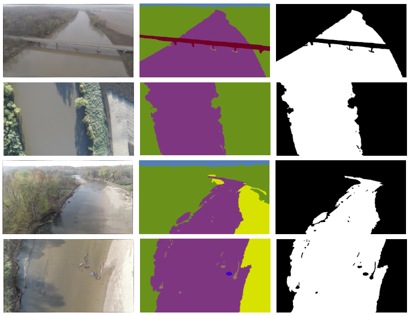

# Aerial Fluvial Image Dataset (AFID) for Semantic Segmentation


## AFID Download
Please find the public Aerial Fluvial Image Dataset ([AFID](https://purr.purdue.edu/publications/4105/1)) on Purdue University Research Repository.
AFID contains manually annotated images shot by the drone over the Wabash River and the Wildcat Creek in Indiana.
Unzip the downloaded zip file and put *AerialFluvialDataset* folder into the *Aerial-Fluvial-Semantic-Segmentation* folder.
Also remember to unzip the *WildcatCreekDataset* and *WabashRiverDataset* in the *AerialFluvialDataset*.


## Dataset Creation
The [FluvialDataset](./src/networks/dataset.py) class accepts image and mask absolute path pairs in a csv file. 
An example is the csv files in this [folder](./src/dataset/afid), containing the whole dataset, train set and test set.
These csv files can be generated using the function *build_csv_from_datasets* in [build_dataset.py](./src/utils/build_dataset.py).
Since the csv files store the absolute paths, it is recommended to rebuild these files after git cloning.


## Preparation
The training mainly depends on PyTorch Lightning and segmentation_models_pytorch.
A virtual python environment (e.g., miniconda) is recommended to test this repo while separating from your system python libraries.
```shell
conda create -n afid python==3.10
```
*afid* is the name of the virtual python environment. After activated this environment by `conda activate afid`,
ensure you have installed all dependencies by
```shell
pip install -r requirements.txt
```


## Training
The training code is in [train.py](./src/networks/train.py). 
An example usage is
```shell
python -m networks.train '../dataset/afid/train.csv' '../dataset/afid/test.csv'
```
If having *No such file or directory* error, make sure the paths in *train.csv* and *test.csv* are pointing to the correct location of AFID data.


## Logging
We use [wandb](https://wandb.ai/home) for logging intermediate checkpoints. 
You can visualize the training progress, and inspect the trained models from their website (although models are also stored locally, it is more convenient to see which model is the best on their website).


## Inference
The inference code is in [inference.py](./src/networks/inference.py).
An example usage is 
```shell
python -m networks.inference '../dataset/afid/test.csv' '../models/unet-resnet34-128x128.ckpt'
```

## Citation
If you use the AFID dataset or this repo in your work, please cite our paper. Thanks.
```
@article{wang2023aerial,
  title={Aerial fluvial image dataset for deep semantic segmentation neural networks and its benchmarks},
  author={Wang, Zihan and Mahmoudian, Nina},
  journal={IEEE Journal of Selected Topics in Applied Earth Observations and Remote Sensing},
  volume={16},
  pages={4755--4766},
  year={2023},
  publisher={IEEE}
}
```